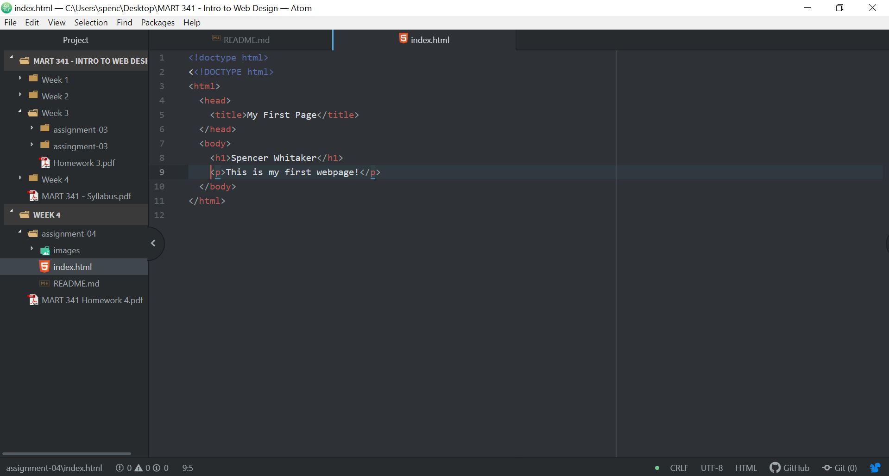

**README for Assignment 04**

Browsers use a series of engines to request and display elements and such on the screen. I personally use Google Chrome as I like the way it syncs all of my Google accounts together and keeps my histories and bookmarks saved between my iPhone and my PC.

A Markup language is a text based language that uses tags to separate elements within a document. HTML is probably the most common Markup language.

