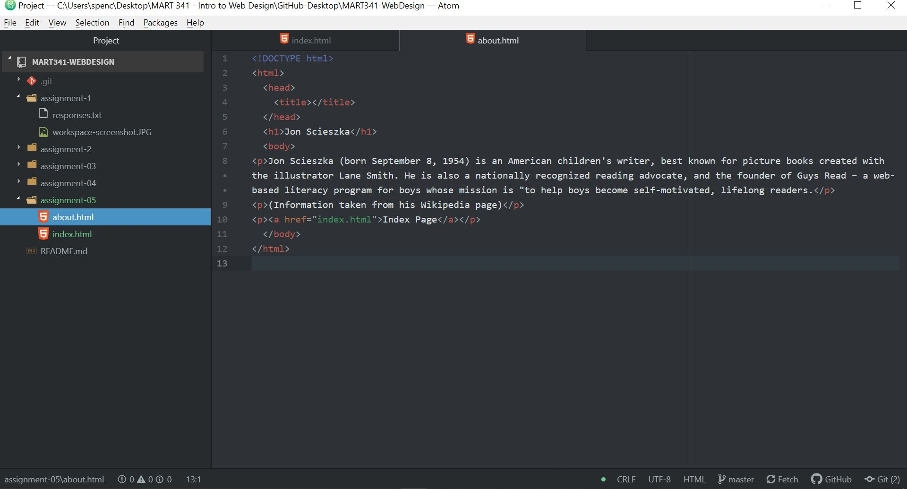

1. I went to Facebook from October 2008. It honestly looked familiar, reminding me of when my mom first got a Facebook account around 2008 on our only family computer. Much of the design was more "blocky" - the current design seems sleek and streamlined in comparison.
2. Learning the basics of HTML, Markdown, and the other languages and the various programs such as Atom, GitHub, etc. that we use to read/write these languages has been very interesting. I felt like I absorbed the course content about the internet and its functionality pretty well. Trying to understand the programs we are using is proving to be a bit more difficult. It was pretty confusing this week trying to go between Atom, my local hard drive directories, GitHub.com, and GitHub Desktop while still keeping track of things. I think the more I integrate my workflow with these programs the more comfortable I will be using them and the more I will understand the benefits of each program. I'm also still struggling a bit to commit the languages to memory (HTML and Markdown specifically). For example, to imbed my screenshot in the next section, I am going to have to go back to the Course Website and find the module discussing Markdown tags to figure out how to link the image. Again, I do feel like I understand the principle behind this image linking - the memorization and familiarity of the tags for each language will come in time.
3.  
